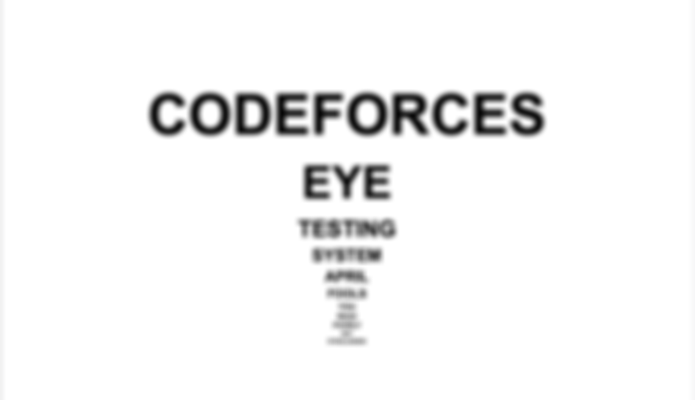

# DEMO IMG

<table>
  <tr>
    <td align="center">
       
      Blurred Input
    </td>
    <td align="center">
       
      Deblurred Output
    </td>
  </tr>
  
  <tr>
    <td align="center">
       
      Blurred Input
    </td>
    <td align="center">
       
      Deblurred Output
    </td>
  </tr>
  <tr>
    <td align="center">
       
      Blurred Input
    </td>
    <td align="center">
       
      Deblurred Output
    </td>
  </tr>
  <tr>
    <td align="center">
       
      Blurred Input
    </td>
    <td align="center">
       
      Deblurred Output
    </td>
  </tr>

  
</table>
